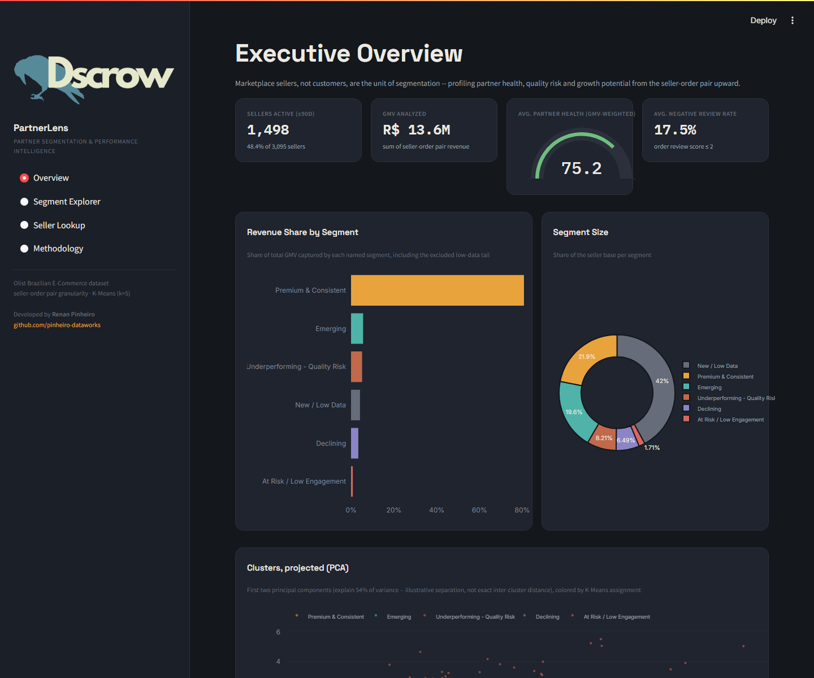
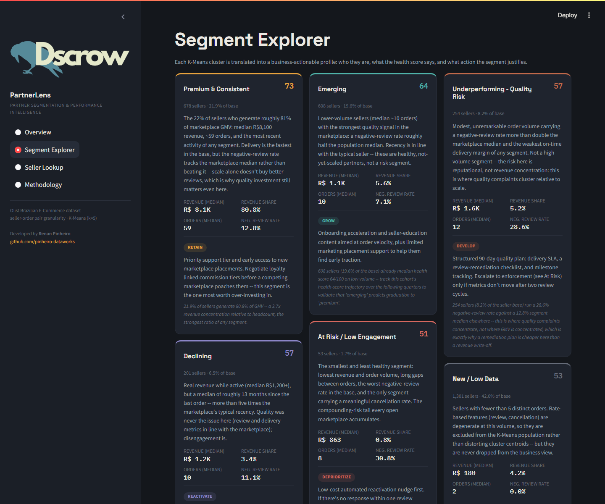
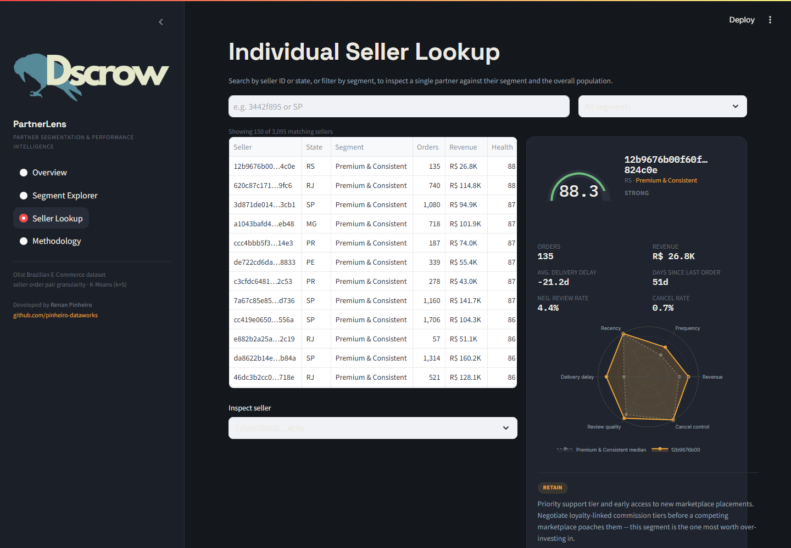

<p align="center">
  
</p>

# PartnerLens

**Partner segmentation & performance intelligence for a marketplace, built on the Olist Brazilian E-Commerce dataset.**

PartnerLens segments Olist **sellers** — not customers, not orders — into named, business-actionable partner profiles, scores each one on a 0–100 health composite, and turns each segment into a quantified recommendation. Everything in the app is computed from the real dataset; there are no placeholder numbers.

> Developed by [Renan Pinheiro](https://github.com/pinheiro-dataworks)



## Problem

Marketplaces live or die on the quality of their partner base, but a platform with thousands of sellers can't manage them one at a time. Olist has 3,095 sellers with wildly different scale, activity and quality — treating them as a single undifferentiated group means over-investing in partners who don't need it and under-reacting to the ones quietly damaging buyer trust. PartnerLens exists to turn that undifferentiated list into a small number of segments a partnerships team can actually act on.

## Approach

- **Unit of analysis: the seller-order pair, not the raw order.** Olist is a marketplace — a single `order_id` in `order_items` can contain items from more than one seller. Aggregating straight from `order_items` inflates a seller's order frequency; aggregating straight from `orders` credits a seller with revenue from items they didn't sell. Every feature is built by first materializing the seller × order_id grain, then rolling up to seller level. See [`src/features.py`](src/features.py).
- **Known limitation, measured rather than assumed.** Reviews attach to the order, not the line item, so a multi-seller order assigns the same review score to every seller involved. Measured directly from the data: **1.3%** of orders (**1.98%** of revenue) are multi-seller — the distortion is real but marginal.
- **A minimum-order threshold, with the sensitivity analysis to defend it.** Sellers with too few orders have degenerate rate features (a negative-review rate can only land on 0%, 50% or 100% at 1–2 orders). At the chosen threshold (≥5 orders), the model covers **58.0%** of sellers and **95.8%** of revenue. The excluded 1,301 sellers aren't dropped — they're the "New / Low Data" segment throughout the app.
- **`log1p` on monetary/count features before scaling**, because revenue and order volume are heavily right-skewed by a handful of high-GMV sellers.
- **A correlation check that changed the feature set.** `log_revenue` and `log_frequency` correlate at 0.80 on the eligible population — past the ~0.7 flag threshold. Frequency was dropped from the K-Means feature set (revenue already captures scale) but kept in the health score and every profile card.
- **K-Means (k=5), chosen on business interpretability, not silhouette alone.** Silhouette's global maximum is the coarser k=2 solution (0.405); k=5 is a local peak (0.250) rather than the statistical optimum — expected for continuous behavioral data with no natural density valleys. k=5 wins because coarser k values collapse segments that need opposite actions into one bucket.
- **A stability check most portfolios skip.** K-Means refit across 5 seeds and compared with the Adjusted Rand Index gives a mean pairwise ARI of **0.980** — the partition is essentially deterministic, not an artifact of initialization.
- **DBSCAN as a critical stress test, not a second candidate.** Density-based clustering doesn't fit this feature space by construction (there are no natural density valleys between "good" and "bad" sellers); the eps sweep confirms it — noise falls monotonically as eps grows but cluster count never exceeds 1. The noise set is reframed as an outlier-detection cross-check on K-Means instead of a discarded experiment.
- **PCA for the scatter plot only, never the clustering space.** PC1+PC2 explain 53.6% of variance — below the ~60% mark needed to trust it as a distance map, so the app labels the projection illustrative. Clustering runs on the original scaled features so centroids stay interpretable in business units.
- **The app trains nothing at runtime.** `scripts/build_pipeline.py` is the offline half; `app/streamlit_app.py` only reads pre-computed Parquet/JSON artifacts from `data/processed/`, which keeps boot fast on Streamlit Community Cloud and keeps "how was this trained" separate from "how is this served."

Full reasoning, with every chart the decisions above are based on, lives in the app's **Methodology** tab and in `notebooks/`.

## Segments

| Segment | Sellers | % of base | % of GMV | Median health | Action |
|---|---:|---:|---:|---:|---|
| Premium & Consistent | 678 | 21.9% | 80.8% | 73 | RETAIN |
| Emerging | 608 | 19.6% | 5.6% | 64 | GROW |
| Underperforming – Quality Risk | 254 | 8.2% | 5.2% | 57 | DEVELOP |
| Declining | 201 | 6.5% | 3.4% | 57 | REACTIVATE |
| New / Low Data (< 5 orders) | 1,301 | 42.0% | 4.2% | 53 | MONITOR |
| At Risk / Low Engagement | 53 | 1.7% | 0.8% | 51 | DEPRIORITIZE |

Names and descriptions are assigned from where each cluster **ranks** against the others on health, recency and quality — never from a fixed cluster id, which is arbitrary and not stable across re-runs. Worth flagging: the original design sketch for this project anticipated a "high volume, low quality" archetype. It doesn't appear in the real k=5 solution — above-median order frequency only shows up in the healthiest cluster. Quality problems concentrate in **low/mid-volume** sellers instead, so the segment names reflect what the data actually shows rather than a preconceived narrative.



## Actions & impact

Every profile card carries a quantified impact statement computed from the actual segmented data, for example:

- **Premium & Consistent**: 21.9% of sellers generate 80.8% of GMV — a 3.7x revenue concentration relative to headcount, the strongest ratio of any segment.
- **Underperforming – Quality Risk**: runs a 28.6% negative-review rate against a ~13% median elsewhere, while holding only 5.2% of GMV — a remediation plan is cheaper here than a revenue write-off.
- **New / Low Data**: 42.0% of the seller base but only 4.2% of GMV — excluding this tail from the clustering model costs negligible revenue coverage.

See the **Segment Explorer** tab for the full set, each with a specific recommended action and the health-score distribution *within* the segment (a "healthy" segment can still carry a lower tail worth a manual look).



## Limitations & next steps

- Review-score attribution to multi-seller orders (1.3% of orders) is an approximation inherent to the source schema, not something a modeling choice downstream can fix.
- This is a **snapshot**, not a trend: the dataset ends 2018-10-17, and every feature is computed against that fixed reference date, never `today()`. A seller's segment membership *over time* — not just at a point in time — is the natural extension.
- DBSCAN's noise set (sellers in sparse regions of the feature space) is computed but not yet surfaced as its own worklist in the app; that's a natural addition for a "manual review" queue.

## Repository structure

```
partnerlens/
├── data/
│   ├── raw/          # Olist CSVs from Kaggle (gitignored -- see Setup below)
│   └── processed/     # parquet + JSON artifacts the app reads (versioned)
├── notebooks/          # 01_eda -> 02_features -> 03_clustering, executed
├── src/
│   ├── config.py       # paths, seed, thresholds, weights, palette -- no magic numbers elsewhere
│   ├── data_loader.py  # raw CSV loading + referential-integrity validation
│   ├── features.py     # seller-order pairs -> seller-level feature matrix
│   ├── clustering.py   # K-Means pipeline, k-selection, stability, DBSCAN, PCA
│   └── profiling.py    # health score, segment naming, quantified recommendations
├── scripts/
│   ├── build_pipeline.py    # runs the full offline pipeline, writes data/processed/
│   └── build_notebooks.py   # (re)generates the notebooks/ from their cell definitions
├── app/
│   ├── streamlit_app.py
│   └── assets/Logo_White.png
├── design/
│   └── partnerlens_dashboard_prototype.html   # original static design sketch
├── requirements.txt      # pinned, for the deployed app
├── requirements-dev.txt  # + notebook tooling
└── README.md
```

## Setup

1. Download the [Olist Brazilian E-Commerce dataset](https://www.kaggle.com/datasets/olistbr/brazilian-ecommerce) from Kaggle and place the 9 CSVs in `data/raw/`.
2. `pip install -r requirements.txt` (add `requirements-dev.txt` instead if you also want to re-run the notebooks).
3. Build the processed artifacts: `python scripts/build_pipeline.py`. This reads `data/raw/`, validates referential integrity, builds seller-order pairs and features, fits the K-Means model, runs the DBSCAN stress test, and writes `data/processed/*.parquet` + `*.json`.
4. Run the app: `streamlit run app/streamlit_app.py`.

The app never touches `data/raw/` or trains anything — it only reads the artifacts from step 3.

## Notebooks

- `01_eda.ipynb` — relational integrity checks, the multi-seller-order limitation quantified, revenue/review-score distributions.
- `02_features.ipynb` — seller-order pair construction, the minimum-order threshold sensitivity analysis, log1p skew treatment.
- `03_clustering.ipynb` — feature correlation and the frequency-drop decision, k-selection (elbow/silhouette/stability), the DBSCAN stress test, PCA caveats, final segment naming.

## Stack

Python, pandas, scikit-learn (StandardScaler + KMeans pipeline, DBSCAN, PCA), Plotly, Streamlit. No model is trained at app runtime.
